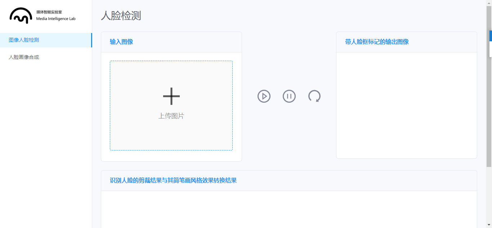
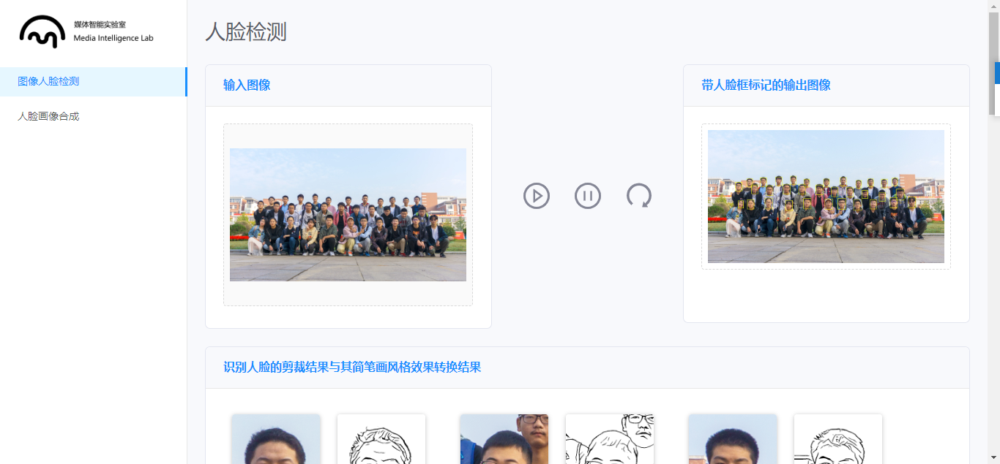
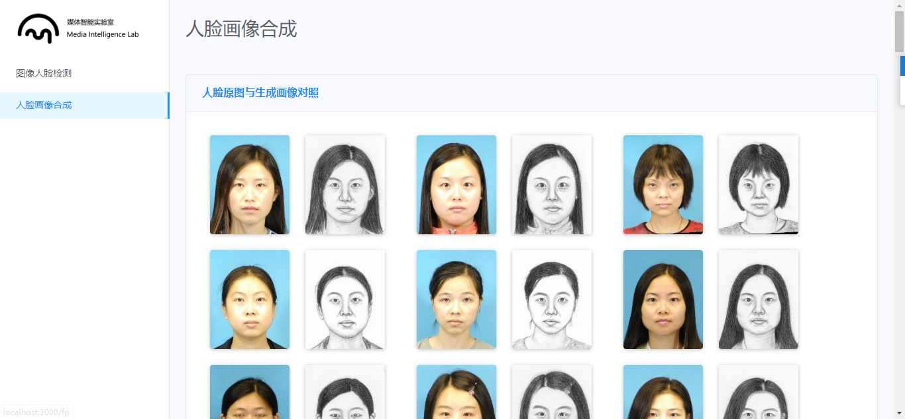

# Deep Learning Display Platform for HDU-MIL Lab

<a href="https://github.com/HDUMIL-Gao-Group"></img></a>
<a href="https://github.com/shaonianruntu"></img></a>

## Usage

1. `yarn install` install environment package
2. `yarn start` run the app in your browser.

## Interface Screenshots

### Page “用户人脸检测”

Click "Upload Image" button, choose "./public/test_multi.jpg" and click "run" button in the right. Wait a minute, the result will show on the right and button.

### Page “人脸画像合成”

## References

- [AliPay 'Ant Design' Design System](https://ant.design/index-cn)

## Contributors

[@shaonianruntu](https://github.com/shaonianruntu)

## License

[MIT](LICENSE) © [@shaonianruntu](https://github.com/shaonianruntu)
